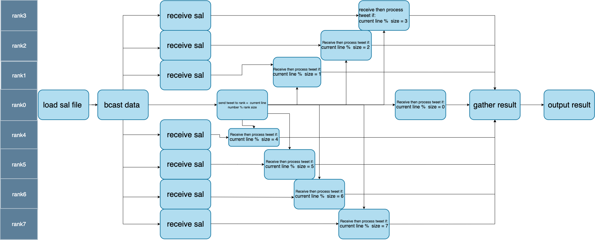

# Cluster and Cloud Computing Assignment 1 – Social Media Analytics 

# Counting Tweets
This program counts the 1. number of tweets made by different author ids, 2. The number of tweets made by different great capital cities, 3. The number of different unique capital cities tweets by author in a JSON file using MPI (Message Passing Interface) to distribute the computation across multiple processes.

# Update from Teaching Teams

This work gets 8/10. Based on the feedback from the teaching teams, this project can be improved by all the ranks can read the file instead of using rank 0 to send data to other ranks.

# Prerequisites
To run this program, you will need:

* Python 3.x
* mpi4py (can be installed using pip)
* Open MPI
* Json
* ijson
* Pandas only for visualize the result
* plotly only for visualize the result

You can install Open MPI on macOS using Homebrew:

```
brew install openmpi
```

You can install mpi4py using pip. Open Terminal and run the following command:

```
pip install mpi4py
```
# Overview

Here is a working pipeline of `twitterSearch.py`: 


# Usage
To run the program, first clone the repository or directly download the zip file:

`git clone https://github.com/<username>/<repository>.git`
Replace <username> and <repository> with your GitHub username and the name of your repository.

Then, navigate to the repository directory:

```cd <repository>```
    
Replace <repository> with the name of your repository.

To run the program, use the following command:

```mpiexec -n <num_processes> python twitterSearch.py <file_name.json>```

Replace <num_processes> with the number of processes you want to use for the computation,
and replace <file_name.json> with the json file you want to search.

Here's an example of how to run the program with 2 processes about file <tinyTwitter.json>:

```mpiexec -n 2 python twitterSearch.py tinyTwitter.json```

If you cannot run the above command you could have tried following:
    
```mpirun -n 2 python twitterSearch.py tinyTwitter.json```  

Or change ```python``` to ```python3```
(Note: We not provide the file of `tinyTwitter.json` and `sal.json` due to the reason of copyright)
    
The program will count the 1. number of tweets made by different author ids, 2. The number of tweets made by different great capital cities, 3. The number of different unique capital cities tweets by author in the <file_name.json> file and present the top 10.

If you could access to a HPC cluster, you could use following command as an example to submit the <twitterSearch.py> to the HPC:

```scp twitterSearch.py your_username@hpc_address:/home/username```

And also you could upload a slurm script to the cluster, because you might need a slurm script to submit the file to cluster, and you could upload the slurm script use following command as an example:
    
```scp <your_slurm_script.slurm> your_username@hpc_address:/home/username```
    
This task have three slurm script already done for testing, which is locate in file `slurm`:
* ```job1.slurm``` : use configuration of 1 node 1 core to execute the twitterSearch.py
* ```job2.slurm``` : use configuration of 1 node 8 core to execute the twitterSearch.py
* ```job3.slurm``` : use configuration of 2 node 8 core to execute the twitterSearch.py(4 core per node) 

Here is an example to submit the slurm script, assume you are login to a cluster and the slrum script is copy to the cluster

```sbatch job1.slurm```

This command would submit the <job1.slurm> to cluster, you could replace the filename to your own slurm script, or other slurm script in this file

If you face a problem about using ijson in a hpc cluster, you could upload the file `install_ijson.slurm` to your task diretory, and run it by

```sbatch install_ijson.slrum```
    
Once your job runs successfully, you should have output file in your home directory in your cluster, the following file is the output from the configuration mention above, the example file is placed in `example_output_slurm`:
    
* ```job_1_output.txt``` : The result of use configuration of 1 node 1 core to execute the twitterSearch.py
* ```job_2_output.txt``` : The result of use configuration of 1 node 8 core to execute the twitterSearch.py
* ```job_3_output.txt``` : The result of use configuration of 2 node 8 core to execute the twitterSearch.py(4 core per node)  
    
(Note: it might be return a `<job_n_error.txt>`, if some error is raised)

As last, we prepare a file call `example_output_slurm/visualization.ipynb`, the data use in `<visualization.ipynb>` are diretly retrieve from the file `job_n_output.txt`, you could run from top to down to see how the `<twitterSearch.py>` performs in `<bigTwitter.json>`, which is a 18.79GB+ Json files.(Note: you might not access to `smallTwitter.json` and `bigTwitter.json` file if you doesn't have access to Spartan)
    
You also could check the `<report.pdf>` to help understand this task
    
# Acknowledgments
This program was created as a project for COMP90024 Cluster and Cloud Computing at University of Melbourne. Special thanks to Prof.Richard Sinnott for their guidance and support.
